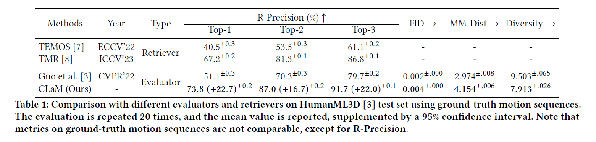

# CLaM: An Open-Source Library for Performance Evaluation of Text-driven Human Motion Generation

## Introduction
An open-source library with a powerful Contrastive Language-and-Motion (CLaM) pre-training evaluator, which can be employed for evaluating a variety of text-driven human motion generation algorithms and motion-to-text/text-to-motion retrieval.


## Python Virtual Environment

Anaconda is recommended to create this virtual environment.

  ```sh
  # Create New Environment
  conda create -n clam python=3.8 -y
  # CUDA 11.0
  pip install torch==1.7.1+cu110 torchvision==0.8.2+cu110 torchaudio==0.7.2 -f https://download.pytorch.org/whl/torch_stable.html
  
  # Install Others
  pip install ftfy regex tqdm scipy numpy==1.23.5 tensorrt spacy matplotlib==3.3.1

  # Install CLIP for CLaM
  cd CLIP_CLaM; python setup.py install --user; cd ..
  ```
  
  ## Download Data & Pre-trained Models
  ### Datasets
  We are using two 3D human motion-language dataset: HumanML3D-synthesis and KIT-ML-synthesis. For both datasets, you could find the download link [[here]](https://drive.google.com/drive/folders/12V2coiO1Zj2mO_0orncX7nUlAhvcRYnh?usp=sharing).   

  
  Download and unzip the dataset files -> Create a dataset folder -> Place related data files in dataset folder:
  ```sh
  mkdir ./dataset/
  ```
  Take HumanML3D-synthesis for an example, the file directory should look like this:  
  ```
  ./dataset/
  ./dataset/HumanML3D/
  ./dataset/HumanML3D/new_joint_vecs/
  ./dataset/HumanML3D/texts/
  ./dataset/HumanML3D/Mean.mpy
  ./dataset/HumanML3D/Std.npy
  ./dataset/HumanML3D/test.txt
  ./dataset/HumanML3D/train.txt
  ./dataset/HumanML3D/train_val.txt
  ./dataset/HumanML3D/val.txt  
  ./dataset/HumanML3D/all.txt 
  ```

#### The Statistics for our HumanML3D-synthesis dataset. 
The following table shows the distribution of the word POS (Part of Speech) in the HumanML3D dataset and our dataset. \#NUM means the number of words for each POS, and \#L represents the proportion (percentage) of words for each POS.


 ### Pre-trained Models for CLIP
  Create a checkpoint folder to place pre-traine models:
  ```sh
  mkdir ./pretrain_clip
  ```
 #### Download models from [[here]](https://drive.google.com/drive/folders/1g84pAku6bzRsVNpR-uKlY6k7wnDFnX7k?usp=sharing). Unzip and place them under checkpoint directory, which should be like
```
./pretrain_clip/ViT-B-32.pt
```

 ### Pre-trained Models for CLaM
  Create a checkpoint folder to place pre-traine models:
  ```sh
  mkdir ./checkpoints
  ```
    
 #### Download models for HumanML3D-synthesis from [[here]](https://drive.google.com/drive/folders/1mYLapj1UA6zkvoDE3NvwIKaV9SyyKChx?usp=sharing). Unzip and place them under checkpoint directory, which should be like
```
./checkpoints/t2m/
./checkpoints/t2m/Comp_v6_KLD01/           # Text-to-motion generation model
./checkpoints/t2m/Decomp_SP001_SM001_H512/ # Motion autoencoder
./checkpoints/t2m/length_est_bigru/        # Text-to-length sampling model
./checkpoints/t2m/text_mot_match/          # Motion & Text feature extractors CLaM for evaluation
 ```


 #### Download models for KIT-ML-synthesis [[here]](https://drive.google.com/drive/folders/1mYLapj1UA6zkvoDE3NvwIKaV9SyyKChx?usp=sharing). Unzip and place them under checkpoint directory.
    
## Comparison on GT Motion Sequences

### Testing CLaM Models

#### HumanML3D-synthesis
```sh
python final_evaluations.py --gpu 0 --only_gt
```
This will evaluate the performance on gt of HumanML3D-synthesis dataset.
The following table shows the comparison with different evaluators and retrievers on HumanML3D-synthesis test set using ground-truth motion sequences.



#### KIT-ML-synthesis
```sh
python final_evaluations_kit.py --gpu 0 --only_gt
```
This will evaluate the performance on gt of KIT-ML-synthesis dataset. 
The following table shows the comparison with different evaluators and retrievers on KIT-ML-synthesis test set using ground-truth motion sequences.


### Training CLaM Models
 All intermediate meta files/animations/models will be saved to checkpoint directory under the folder specified by argument "--name".

#### HumanML3D-synthesis
```sh
python train_tex_mot_match.py --name text_mot_match --gpu_id 0 --batch_size 64 --dataset_name t2m --lr 3e-5 --use_adamw --adamw_weight_decay 1e-1 --beta2 0.999 --eps 1e-8 --use_transformers --use_transformers_pretrain --tau 0.1 --alpha 0.02
```
#### KIT-ML-synthesis
```sh
python train_tex_mot_match.py --name text_mot_match --gpu_id 0 --batch_size 64 --dataset_name kit --lr 3e-5 --use_adamw --adamw_weight_decay 1e-1 --beta2 0.999 --eps 1e-8 --use_transformers --use_transformers_pretrain --tau 0.1 --alpha 0.02
```


## Comparison on Existing Text-to-Motion Algorithms


### Testing  [T2M](https://openaccess.thecvf.com/content/CVPR2022/papers/Guo_Generating_Diverse_and_Natural_3D_Human_Motions_From_Text_CVPR_2022_paper.pdf) (CVPR 2022)  Algorithm

#### HumanML3D-synthesis
```sh
python final_evaluations.py --gpu 0 
```
This will evaluate the performance of default motion generator named 'T2M' trained by Chuan Guo.
The following table shows the evaluation results on HumanML3D-synthesis test set with different text-to-motion algorithms.


#### KIT-ML-synthesis
```sh
python final_evaluations_kit.py --gpu 0
```
This will evaluate the performance of default motion generator named 'T2M' trained by Chuan Guo.

### Testing others
For other text-to-motion algorithms, you can find in [projects/](https://github.com/SheldongChen/CLaM/tree/main/projects)

## License
CLaM is released under the [MIT License](https://github.com/SheldongChen/CLaM/blob/main/LICENSE).

## Acknowledgement
This repo is implemented based on [text-to-motion](https://github.com/EricGuo5513/text-to-motion) and [CLIP](https://github.com/openai/CLIP).