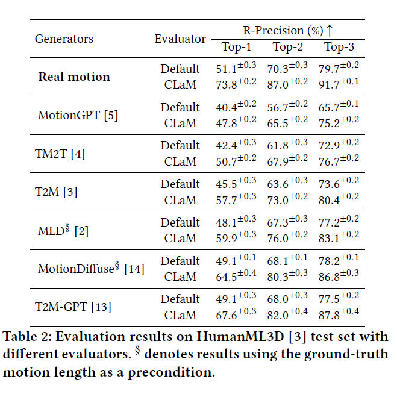

## Comparison on Existing Text-to-Motion Algorithms

### 📜 Supported Text-to-Motion Algorithms
- [x] [TM2T](https://github.com/EricGuo5513/TM2T) (ECCV'22).
- [x] [T2M](https://github.com/EricGuo5513/text-to-motion) (CVPR'22).
- [x] [MLD](https://github.com/ChenFengYe/motion-latent-diffusion) (CVPR'23).
- [x] [Motion Diffuse](https://github.com/mingyuan-zhang/MotionDiffuse) (TPAMI'24).
- [x] [T2M-GPT](https://github.com/Mael-zys/T2M-GPT) (CVPR'23).
- [x] [MotionGPT](https://github.com/OpenMotionLab/MotionGPT) (NeurIPS'23).
- [x] [MoMask](https://github.com/EricGuo5513/momask-codes) (CVPR'24).

### How to Evaluation on above Algorithms?

This library can be applied as a plugin to existing algorithms. Take the TM2T algorithm as an example: 
1. Download the github project of the [TM2T](https://github.com/EricGuo5513/TM2T) algorithm.
2. Install the requirements for python environment of TM2T.
3. Replace the original files with the files under [TM2T/](https://github.com/SheldongChen/CLaM/tree/main/projects/TM2T).
4. Replace the checkpoints of default evaluator with the [checkpoints](https://drive.google.com/drive/folders/1mYLapj1UA6zkvoDE3NvwIKaV9SyyKChx?usp=sharing) of CLaM on HumanML3D dataset. 
5. (Optional) Replace the HumanML3D dataset as our HumanML3D-synthesis dataset. Note that this step is non-necessary because the test set for both datasets is same. 
6. Follow the TM2T README file for the testing of TM2T Algorithms.

The following table shows the evaluation results on HumanML3D-synthesis test set with different text-to-motion algorithms.

